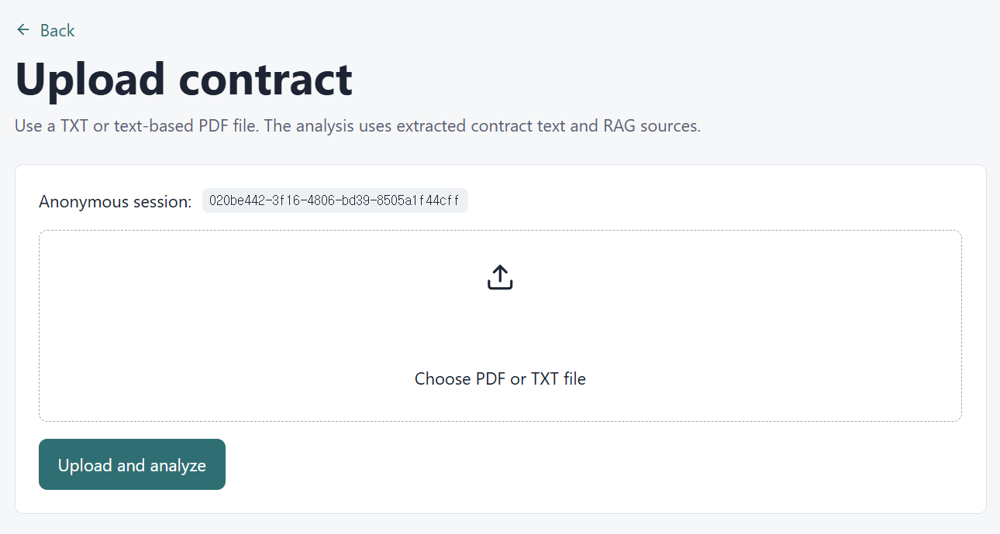
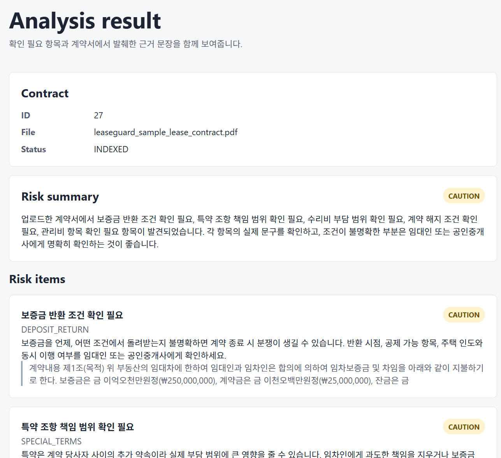
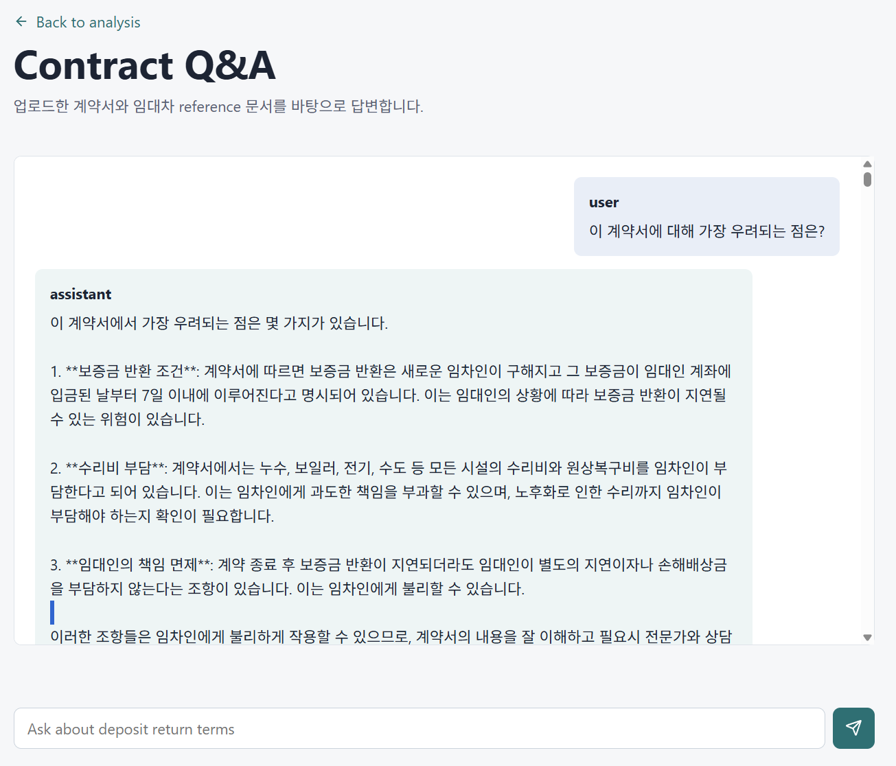
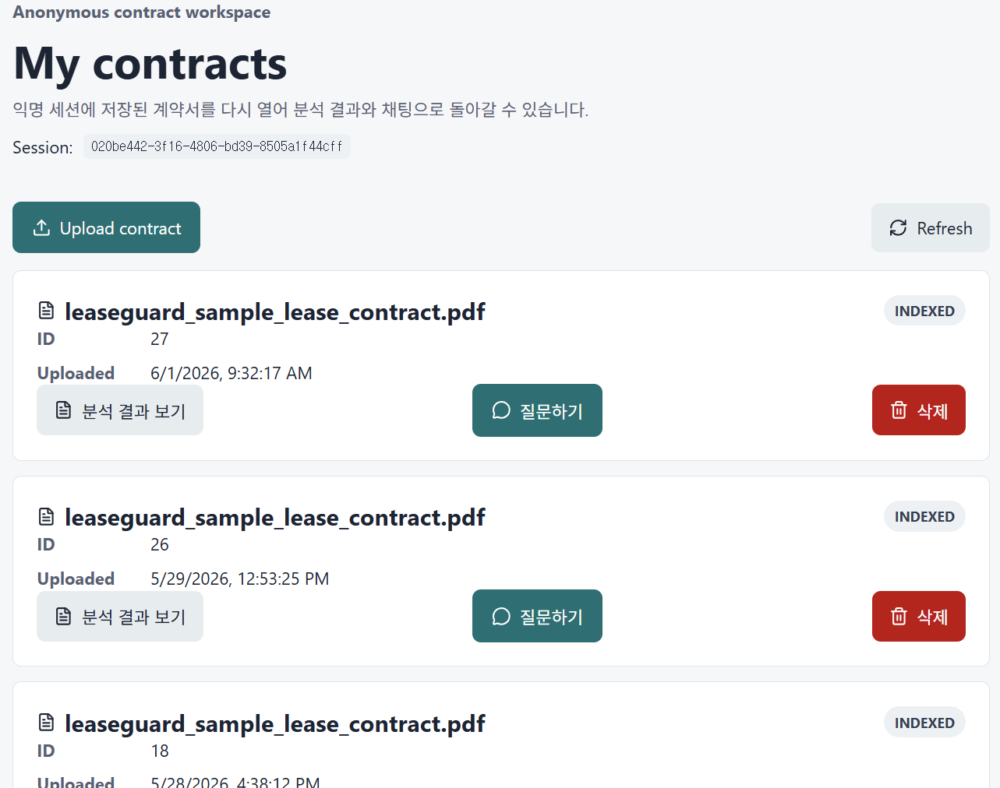
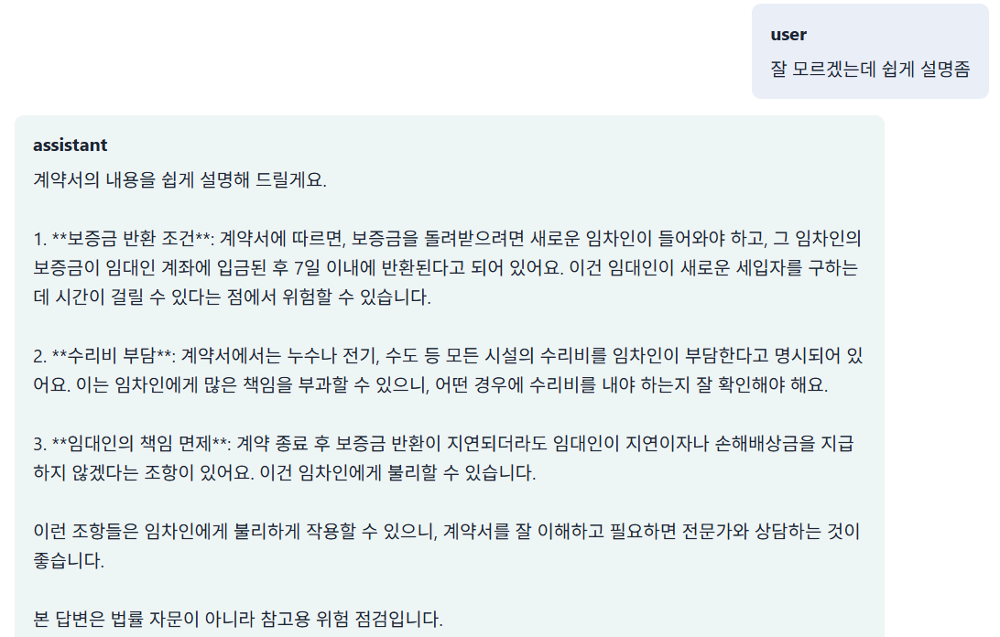
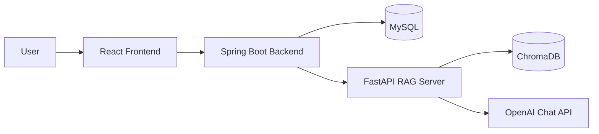
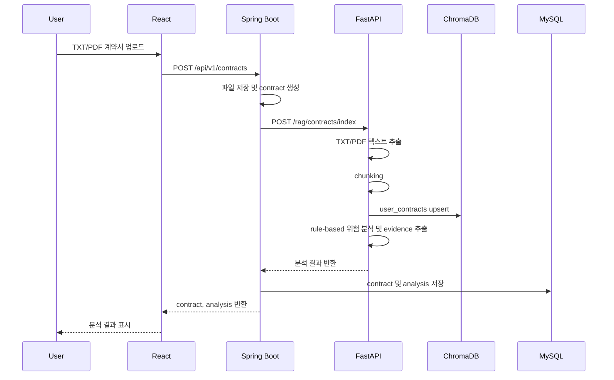
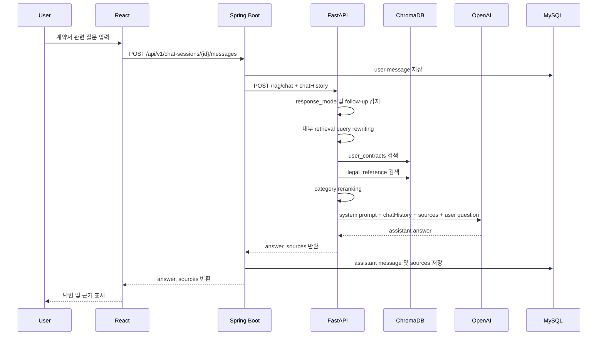

# LeaseGuard AI

## 1. 프로젝트 개요

**LeaseGuard AI**는 부동산 임대차계약서를 업로드하면 계약서의 주요 위험 요소를 점검하고, 법령·공공 체크리스트·curated reference 문서를 기반으로 질문에 답변하는 RAG 기반 AI 도우미이다.

본 프로젝트의 목적은 법률 전문가가 아닌 사용자가 임대차계약서의 핵심 조항을 이해하고, 임대인 또는 공인중개사에게 확인해야 할 질문을 정리하도록 돕는 데 있다. 특히 보증금 반환, 특약 조항, 수리비 부담, 전입신고와 확정일자, 등기부등본 확인, 전세사기 예방 체크리스트와 같은 항목을 중심으로 참고용 위험 점검을 제공한다.

본 서비스는 법률 자문 서비스가 아니다. 계약 체결 여부, 계약 무효 여부, 위법 여부, 소송 승패를 단정하지 않는다. 제공하는 답변은 계약서 조각과 reference source에 근거한 참고용 위험 점검이며, 최종 판단이 필요한 경우 전문가 상담을 권장한다.

### 1.1 기획 배경

임대차계약서는 일반 사용자가 이해하기 어려운 법률 용어와 실무 표현을 포함한다. 보증금 반환 시점, 임차인 수리비 부담 범위, 특약 조항, 전입신고와 확정일자, 등기부등본상 선순위 권리 등은 계약 이후 분쟁으로 이어질 수 있는 대표적 확인 항목이다.

LeaseGuard AI는 사용자가 계약서를 업로드하면 계약서 원문에서 관련 문장을 발췌하고, ChromaDB에 저장된 reference 문서와 함께 검색한 뒤 OpenAI Chat API로 답변을 생성한다. 답변에는 sources를 함께 제공하여 사용자가 근거 문장을 확인할 수 있도록 했다.

### 1.2 MVP 범위

현재 MVP는 비로그인 익명 세션 기반으로 동작한다. 회원가입, JWT 인증, 등기부등본 OCR 검증, 시세 API 연동, 보증보험 가입 가능성 자동 판단은 구현하지 않았다.

구현된 MVP 범위는 다음과 같다.

- 익명 세션 생성 및 `localStorage` 저장
- TXT/PDF 계약서 업로드
- 텍스트 추출 가능한 PDF 처리
- 계약서 chunking 및 ChromaDB 저장
- curated reference 문서 인덱싱
- rule-based 계약서 위험 항목 분석
- 계약서 원문 evidence 발췌
- RAG 기반 계약서 Q&A
- OpenAI Chat API 기반 답변 생성
- response mode 기반 답변 전략 조정
- 최근 대화 맥락 전달
- 답변 sources 표시
- 채팅 기록 및 source 저장
- 이전 계약서 목록 조회, 분석 재진입, 채팅 복원
- 계약서 soft delete
- 브라우저 익명 세션 초기화

## 2. 주요 기능

| 기능 | 구현 내용 |
| --- | --- |
| 익명 세션 | 로그인 없이 UUID 기반 `anonymousSessionId`를 생성하고 브라우저 `localStorage`에 저장한다. |
| 계약서 업로드 | React에서 multipart 방식으로 TXT/PDF 파일을 업로드하고 Spring Boot가 파일을 저장한다. |
| PDF 텍스트 추출 | FastAPI가 `pypdf`로 텍스트 추출 가능한 PDF를 처리한다. 스캔본 PDF는 OCR 미지원 오류를 반환한다. |
| 계약서 인덱싱 | 계약서 텍스트를 chunk로 나누어 ChromaDB `user_contracts` collection에 저장한다. |
| reference 인덱싱 | curated reference 문서와 manifest를 읽어 ChromaDB `legal_reference` collection에 저장한다. |
| 위험 분석 | rule-based 분석으로 보증금 반환, 특약, 수리비, 계약 해지, 관리비 관련 항목을 점검한다. |
| evidence 표시 | 위험 항목별로 계약서 원문에서 관련 문장 또는 주변 문맥을 발췌한다. |
| RAG 검색 | 계약서 chunk와 reference chunk를 함께 검색하고 category 기반 reranking을 적용한다. |
| OpenAI 답변 | 검색된 sources와 chatHistory를 바탕으로 OpenAI Chat API가 답변을 생성한다. |
| response mode | 질문 의도에 따라 쉬운 설명, 비유, 임대인 질문 문장, 짧은 요약, 조항 수정 예시, 법률 판단 거절 전략을 적용한다. |
| 채팅 복원 | 저장된 chat session과 message를 다시 불러와 이전 대화를 표시한다. |
| Dashboard | 익명 세션 기준으로 이전 계약서 목록을 조회하고 분석 결과 또는 채팅 화면으로 재진입한다. |
| 계약서 삭제 | Dashboard에서 계약서를 soft delete하고 목록에서 제외한다. |

## 3. 화면 예시

실제 스크린샷 파일은 `docs/screenshots/` 경로에 저장되어 있다.

### 3.1 계약서 업로드 화면



계약서 TXT/PDF 파일을 선택하고 업로드한다. 업로드 후 Spring Boot가 FastAPI RAG 서버에 계약서 인덱싱과 분석을 요청한다.

### 3.2 분석 결과 화면



전체 위험도, 요약, 위험 항목, 설명, 계약서 원문 evidence를 표시한다. 사용자는 분석 결과에서 바로 채팅 화면으로 이동할 수 있다.

### 3.3 RAG 채팅 화면



사용자 질문과 assistant 답변을 표시한다. assistant 답변은 줄바꿈을 유지하며, 계약서 근거와 reference 근거를 sources로 구분해 보여준다.

### 3.4 Dashboard 화면



익명 세션 기준으로 업로드한 계약서 목록을 보여준다. 각 계약서에 대해 분석 결과 보기, 질문하기, 삭제 기능을 제공한다.

### 3.5 response mode 예시 화면



쉬운 설명, 비유, 임대인에게 물어볼 문장, 짧은 요약 등 사용자 질문 의도에 따라 답변 전략이 달라지는 모습을 확인할 수 있다.

## 4. 시스템 아키텍처



### 4.1 구성 요소 역할

| 구성 요소 | 역할 |
| --- | --- |
| React Frontend | 계약서 업로드, 분석 결과, 채팅, Dashboard UI를 제공한다. |
| Spring Boot Backend | 익명 세션, 계약서 메타데이터, 분석 결과, 채팅 세션, 메시지, sources를 MySQL에 저장한다. |
| FastAPI RAG Server | 계약서 텍스트 추출, chunking, ChromaDB 인덱싱, RAG 검색, OpenAI 호출을 수행한다. |
| ChromaDB | `legal_reference`와 `user_contracts` collection을 통해 reference 및 계약서 chunk를 저장·검색한다. |
| MySQL | 익명 세션, 계약서, 분석 결과, 채팅 기록, message sources를 저장한다. |
| OpenAI Chat API | 검색된 sources와 chatHistory를 바탕으로 자연어 답변을 생성한다. |

React는 OpenAI API 또는 FastAPI를 직접 호출하지 않는다. 모든 요청은 `React → Spring Boot → FastAPI → OpenAI API` 흐름을 따른다.

## 5. 데이터 흐름

### 5.1 계약서 업로드 및 분석 흐름



### 5.2 reference 문서 인덱싱 흐름

1. FastAPI가 `rag-server/data/reference_sources/curated` 문서를 읽는다.
2. `source_manifest.json`을 로드해 category, sourceType, keywords 등 metadata를 구성한다.
3. 문서를 글자 수 기반 chunk로 나눈다.
4. 안정적인 id를 생성해 ChromaDB `legal_reference` collection에 upsert한다.
5. 같은 문서를 다시 인덱싱해도 과도한 중복 저장이 발생하지 않도록 처리한다.

### 5.3 채팅/RAG 답변 흐름



## 6. AI/RAG 구현 상세

### 6.1 RAG 적용 이유

본 프로젝트는 법령과 체크리스트를 모델에 직접 학습시키는 방식이 아니라, reference 문서를 ChromaDB에 저장하고 질문 시 관련 chunk를 검색하는 RAG 방식을 사용한다. 이 방식은 LLM 단독 답변보다 source 기반 설명을 제공하기 쉽고, 제공된 자료 밖의 내용을 단정하지 않도록 제어하기에 적합하다.

### 6.2 reference dataset

reference 문서는 curated txt 파일과 manifest로 구성한다.

```text
rag-server/data/reference_sources/
├── curated/
└── source_manifest.json
```

현재 reference 문서는 다음 주제를 포함한다.

- 보증금 반환
- 특약 조항
- 수리비 부담 및 원상복구
- 전입신고와 확정일자
- 등기부등본 및 선순위 권리 확인
- 전세사기 예방 체크리스트
- 표준계약서 기준 항목

### 6.3 ChromaDB collection

| Collection | 저장 대상 | 주요 metadata |
| --- | --- | --- |
| `legal_reference` | 법령, guide, checklist, 표준계약서 기준 문서 | `category`, `sourceType`, `title`, `fileName`, `chunkIndex`, `keywords` |
| `user_contracts` | 사용자가 업로드한 계약서 chunk | `anonymousSessionId`, `contractId`, `documentName`, `chunkIndex` |

`user_contracts` 검색은 반드시 `anonymousSessionId`와 `contractId` 기반 filter를 사용한다. 다른 사용자의 계약서 chunk가 검색 결과에 섞이지 않도록 격리한다.

### 6.4 검색 품질 개선

현재 RAG 검색은 다음 방식을 사용한다.

- 글자 수 기반 chunking
- 자체 hash/token n-gram 기반 embedding
- query expansion
- category metadata 기반 reranking
- contract/reference source mix 유지
- 테스트 질문 기반 검색 품질 점검

OpenAI embedding은 현재 사용하지 않는다. LangChain도 현재 MVP에 사용하지 않는다.

### 6.5 OpenAI 답변 생성

FastAPI는 ChromaDB 검색 결과를 sources로 구성하고 OpenAI Chat API에 전달한다. 기본 모델은 `gpt-4o-mini`이며, `OPENAI_MODEL` 환경변수로 변경할 수 있다.

OpenAI 호출 조건은 다음과 같다.

- `OPENAI_API_KEY`가 있으면 OpenAI Chat API를 호출한다.
- API key가 없거나 호출에 실패하면 template fallback 답변을 반환한다.
- fallback 답변도 법률 자문이 아니라 참고용 위험 점검이라는 문구를 유지한다.
- sources가 없으면 제공된 자료만으로는 확인하기 어렵다는 취지로 답한다.

### 6.6 LeaseGuard AI 페르소나

LeaseGuard AI는 법률 전문가처럼 최종 판단을 단정하지 않는다. 사용자가 이해하기 어려운 조항을 쉬운 말로 설명하고, 임대인 또는 공인중개사에게 확인할 질문을 정리하도록 돕는다.

답변 원칙은 다음과 같다.

- 계약서 조각과 reference source에 근거한다.
- sources에 없는 내용은 단정하지 않는다.
- 계약 무효, 위법, 소송 승패, 계약 체결 가능 여부를 단정하지 않는다.
- 필요한 경우 전문가 상담을 권장한다.
- 마지막에 법률 자문이 아니라 참고용 위험 점검이라는 취지를 포함한다.

### 6.7 response mode 기반 프롬프트 라우팅

`response_mode`는 고정 출력 템플릿이 아니라 답변 전략과 톤을 정하는 힌트로 사용한다.

| response_mode | 목적 |
| --- | --- |
| `structured_analysis` | 기본 위험 분석 답변 |
| `easy_explanation` | 쉬운 설명 |
| `analogy` | 비유 또는 예시 중심 설명 |
| `landlord_question` | 임대인에게 물어볼 문장 제안 |
| `brief_summary` | 짧은 핵심 요약 |
| `rewrite_clause` | 조항 수정 방향 및 참고용 예시 문구 |
| `legal_judgment_refusal` | 최종 법률 판단 단정 회피 및 확인사항 안내 |

### 6.8 대화 맥락 유지

Spring Boot는 최근 메시지 일부를 `chatHistory`로 FastAPI에 전달한다. FastAPI는 이를 OpenAI messages에 포함해 “그 부분”, “방금 말한 조항”, “그럼 어떻게 해야 해” 같은 후속 질문을 이전 대화 흐름에 맞게 해석한다.

또한 FastAPI는 내부 retrieval query rewriting을 수행한다. 이 과정은 사용자에게 보이는 원문 질문을 바꾸지 않고, ChromaDB 검색과 OpenAI prompt 구성을 위해 내부적으로만 사용한다.

## 7. Backend 구현 상세

Backend는 Spring Boot 기반 API 서버이다. React와 FastAPI 사이의 중간 계층 역할을 수행하며, 데이터 영속화와 사용자 요청 검증을 담당한다.

### 7.1 패키지 역할

| 패키지 | 역할 |
| --- | --- |
| `anonymous` | 익명 세션 생성 및 조회 |
| `contract` | 계약서 업로드, 목록 조회, 상세 조회, 분석 결과 조회, soft delete |
| `chat` | 채팅 세션 생성, 메시지 저장, sources 저장, chatHistory 전달 |
| `rag` | FastAPI RAG 서버 호출 client 및 DTO |
| `global` | 공통 응답, 예외 처리, 설정 |

### 7.2 주요 API

| Method | Endpoint | 설명 |
| --- | --- | --- |
| POST | `/api/v1/anonymous-sessions` | 익명 세션 생성 |
| POST | `/api/v1/contracts` | 계약서 업로드 및 분석 |
| GET | `/api/v1/contracts` | 계약서 목록 조회 |
| GET | `/api/v1/contracts/{contractId}` | 계약서 상세 조회 |
| GET | `/api/v1/contracts/{contractId}/analysis` | 분석 결과 조회 |
| DELETE | `/api/v1/contracts/{contractId}` | 계약서 soft delete |
| POST | `/api/v1/chat-sessions` | 채팅 세션 생성 |
| GET | `/api/v1/chat-sessions` | 채팅 세션 목록 조회 |
| GET | `/api/v1/chat-sessions/{chatSessionId}/messages` | 메시지 목록 조회 |
| POST | `/api/v1/chat-sessions/{chatSessionId}/messages` | 메시지 전송 및 RAG 답변 생성 |

## 8. FastAPI RAG Server 구현 상세

FastAPI는 계약서 분석과 RAG 검색을 담당한다.

| Method | Endpoint | 설명 |
| --- | --- | --- |
| GET | `/health` | RAG 서버 상태 확인 |
| POST | `/rag/references/index` | reference 문서 인덱싱 |
| POST | `/rag/contracts/index` | 계약서 인덱싱 및 rule-based 분석 |
| POST | `/rag/chat` | RAG 검색 및 OpenAI 답변 생성 |

### 8.1 주요 서비스 파일

| 파일 | 역할 |
| --- | --- |
| `contract_parser.py` | TXT/PDF 텍스트 추출 |
| `chunking_service.py` | 문서 chunking |
| `reference_indexing_service.py` | reference 문서 인덱싱 |
| `contract_indexing_service.py` | 계약서 인덱싱 |
| `retrieval_service.py` | ChromaDB 검색, query expansion, reranking |
| `llm_service.py` | OpenAI 호출, response mode, fallback, prompt 구성 |
| `risk_analysis_service.py` | rule-based 위험 항목 분석 및 evidence 추출 |
| `chroma_client.py` | ChromaDB client 및 collection 관리 |

## 9. Frontend 구현 상세

Frontend는 React와 Vite 기반으로 구현했다. 최소 디자인을 적용하되 기능 검증이 가능하도록 화면을 구성했다.

| 화면 | 기능 |
| --- | --- |
| Home | 서비스 소개 및 업로드 시작 |
| ContractUpload | TXT/PDF 계약서 업로드 및 분석 요청 |
| Analysis | 위험도, 요약, risk items, evidence 표시 |
| Chat | 채팅 메시지, assistant 답변, sources 표시 |
| Dashboard | 이전 계약서 목록, 분석 재진입, 채팅 재진입, 삭제, 세션 초기화 |

Frontend는 `anonymousSessionId`를 `localStorage`에 저장하고 모든 API 요청에 `X-Anonymous-Session-Id` header를 포함한다.

## 10. 실행 방법

### 10.1 사전 요구사항

- Java 17
- Node.js 및 npm
- Python 3.x
- Docker Desktop
- OpenAI API key

### 10.2 환경 변수

루트의 `.env.example`을 참고해 `.env`를 구성한다.

```env
# MySQL
MYSQL_ROOT_PASSWORD=root
MYSQL_DATABASE=leaseguard
MYSQL_USER=leaseguard
MYSQL_PASSWORD=leaseguard123

# Spring Boot
SPRING_DATASOURCE_URL=jdbc:mysql://localhost:3306/leaseguard
SPRING_DATASOURCE_USERNAME=leaseguard
SPRING_DATASOURCE_PASSWORD=leaseguard123
RAG_SERVER_BASE_URL=http://localhost:8000

# FastAPI
OPENAI_API_KEY=your_openai_api_key
OPENAI_MODEL=gpt-4o-mini
CHROMA_HOST=localhost
CHROMA_PORT=8001
```

실제 `.env` 파일은 Git에 포함하지 않는다. OpenAI API key는 frontend에 노출하지 않는다.

### 10.3 MySQL 및 ChromaDB 실행

```powershell
docker compose up -d mysql chromadb
```

MySQL은 host `localhost`, port `3306`을 사용한다. ChromaDB는 host `localhost`, port `8001`을 사용한다.

### 10.4 Backend 실행

```powershell
cd backend
.\gradlew.bat bootRun
```

Backend 기본 port는 `8080`이다.

### 10.5 FastAPI 실행

```powershell
cd rag-server
.\.venv\Scripts\Activate.ps1
pip install -r requirements.txt
uvicorn app.main:app --reload --port 8000
```

FastAPI 기본 port는 `8000`이다.

### 10.6 Frontend 실행

```powershell
cd frontend
npm.cmd install
npm.cmd run dev
```

Frontend 기본 port는 `5173`이다. PowerShell에서 실행 문제가 있으면 `npm` 대신 `npm.cmd`를 사용한다.

## 11. 테스트 시나리오

### 11.1 계약서 업로드 및 분석

1. 익명 세션을 생성한다.
2. TXT 또는 텍스트 추출 가능한 PDF 계약서를 업로드한다.
3. Spring Boot가 FastAPI `/rag/contracts/index`를 호출한다.
4. FastAPI가 계약서 텍스트를 추출하고 ChromaDB에 저장한다.
5. rule-based 분석 결과와 evidence를 반환한다.
6. React가 분석 결과 화면에 risk items를 표시한다.

### 11.2 RAG 채팅

예시 질문은 다음과 같다.

- 이 계약에서 가장 위험한 점은?
- 보증금 반환 조건이 위험한지 봐줘
- 특약 조항 중 임차인에게 불리한 부분이 있어?
- 전입신고와 확정일자는 왜 필요해?
- 등기부등본에서 무엇을 확인해야 해?

### 11.3 후속 질문

예시 질문 흐름은 다음과 같다.

1. 이 계약에서 가장 위험한 점은?
2. 그럼 내가 현실적으로 할 수 있는 일은?
3. 방금 말한 조항을 임대인에게 어떻게 물어봐야 해?
4. 그 조항을 어떻게 고치면 좋을까?

### 11.4 response mode

예시 질문은 다음과 같다.

- 너무 어려운데 쉽게 설명해 줘
- 비유를 통해 설명해 줘
- 임대인에게 뭐라고 물어보면 돼?
- 짧게 핵심만 말해 줘
- 이 조항을 어떻게 고치면 좋을까?
- 이 계약 무효야? 소송하면 이겨?

## 12. 검증 결과

개발 과정에서 다음 항목을 검증했다.

| 검증 항목 | 결과 |
| --- | --- |
| Spring Boot compile | 성공 |
| React build | 성공 |
| FastAPI compileall | 성공 |
| FastAPI app import | 성공 |
| `/rag/references/index` | 성공 |
| `/rag/contracts/index` | 성공 |
| `/rag/chat` fallback | 성공 |
| `/rag/chat` OpenAI 호출 | 성공 |
| 계약서 삭제 후 목록 제외 | 성공 |
| 삭제된 계약서 분석·채팅 진입 차단 | 성공 |
| 세션 초기화 후 새 익명 세션 생성 | 성공 |

세부 API 테스트 명령은 `TEST_COMMANDS.md`와 `TEST_RAG_SEARCH.md`에 정리했다.

## 13. 트러블슈팅

| 문제 | 원인 및 해결 |
| --- | --- |
| PowerShell에서 `curl` 동작이 예상과 다름 | PowerShell alias 문제이므로 `curl.exe` 또는 `Invoke-RestMethod`를 사용한다. |
| PowerShell 5에서 한글이 `?`로 표시됨 | 콘솔 입출력 인코딩 문제이다. React와 API JSON은 UTF-8 기준으로 정상 처리한다. |
| `vite` command not found | `frontend`에서 `npm.cmd install`을 먼저 실행한다. |
| npm 실행 정책 문제 | PowerShell에서는 `npm.cmd`를 사용한다. |
| port `8080` already in use | 기존 Spring Boot 프로세스를 종료하거나 port를 변경한다. |
| ChromaDB telemetry warning | 기능 동작에는 영향이 없는 경고이다. |
| `message_sources.source_type` 길이 초과 | DB column 길이를 확장하고 FastAPI `sourceType`을 정규화했다. |
| 스캔 PDF 업로드 실패 | OCR을 구현하지 않았으므로 텍스트 추출 가능한 PDF만 지원한다. |
| OpenAI API 호출 실패 | `OPENAI_API_KEY`, billing 상태, network 접근 가능 여부를 확인한다. |

## 14. 현재 한계

- 스캔 PDF와 이미지 OCR은 지원하지 않는다.
- OpenAI embedding은 사용하지 않는다.
- reference 문서 범위는 MVP 검증용 curated dataset 중심이다.
- 익명 세션은 브라우저 `localStorage` 기반이므로 브라우저 변경 시 기존 목록에 접근하기 어렵다.
- 실제 서비스 배포, 인증, rate limit, 보안 hardening은 구현하지 않았다.
- 등기부등본 자동 검증, 시세 비교, 보증보험 가능성 판단은 구현하지 않았다.

## 15. 향후 발전 방향

- OCR 기반 스캔 PDF 및 이미지 계약서 처리
- OpenAI embedding 또는 한국어 sentence-transformers 기반 semantic embedding 도입 검토
- 법령 조문 단위 reference 보강
- source citation UI 개선
- 계약서 조항별 clauseType 자동 분류
- 위험도 스코어링 고도화
- 사용자 계정 기반 문서 관리
- 배포 환경 구성 및 보안 강화
- 등기부등본 OCR 분석
- 주소 기반 시세 및 실거래가 비교
- 변호사 또는 공인중개사 상담 연계

## 16. 회고

본 프로젝트를 통해 단순 LLM 호출보다 RAG 검색 품질과 metadata 설계가 답변 품질에 큰 영향을 준다는 점을 확인했다. reference 문서를 어떻게 chunking하고 어떤 category와 keywords를 부여하는지가 검색 결과와 source 품질을 좌우했다.

또한 법률 도메인에서는 단정적인 답변보다 안전한 페르소나와 출처 기반 설명이 중요하다. LeaseGuard AI는 최종 법률 판단을 제공하지 않고, 사용자가 계약서에서 확인해야 할 위험 요소와 질문을 정리하도록 돕는 방향으로 설계했다.

Spring Boot와 FastAPI를 분리한 구조는 일반 서비스 로직과 AI/RAG 로직을 분리하는 데 효과적이었다. React에서는 업로드, 분석, 채팅, 대시보드 흐름을 구성하면서 실제 사용성에는 대화 복원, 이전 계약서 재진입, 삭제, 세션 초기화 같은 UX 기능도 중요하다는 점을 확인했다.
