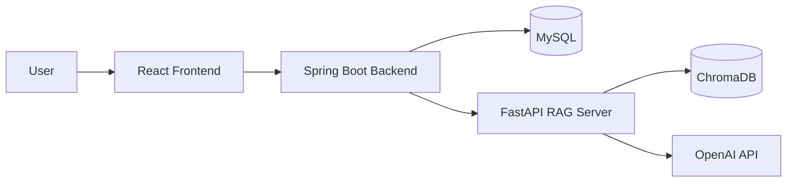
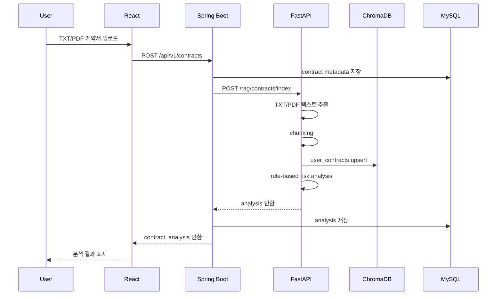
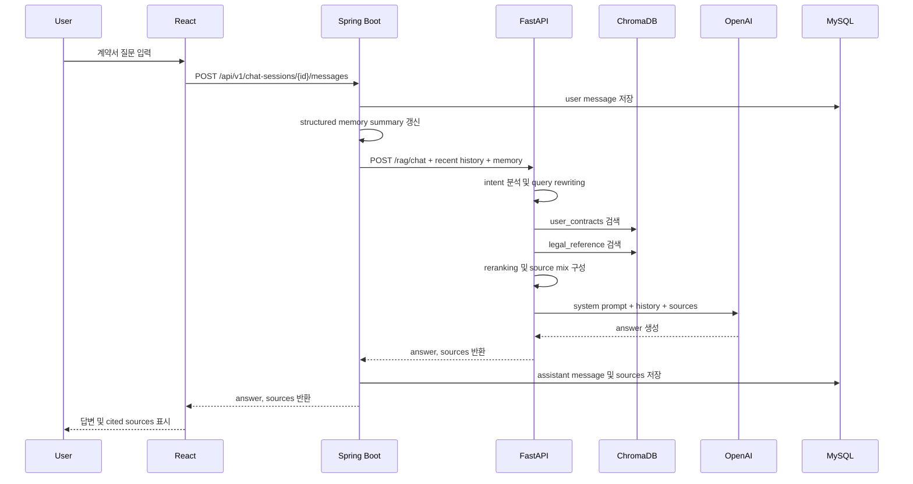
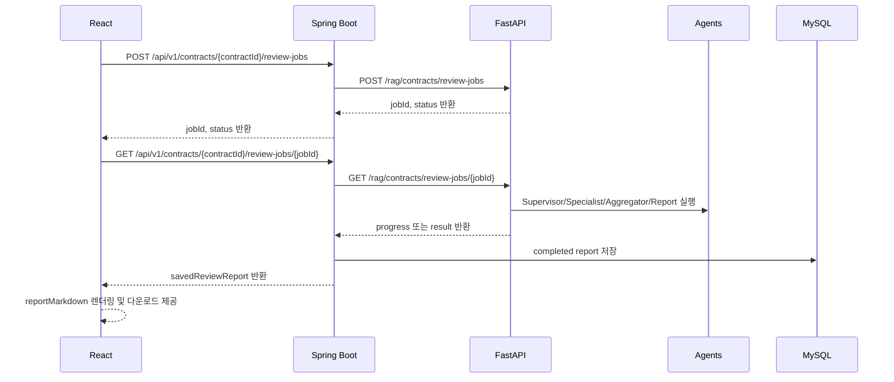
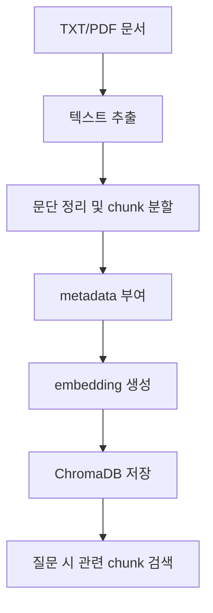
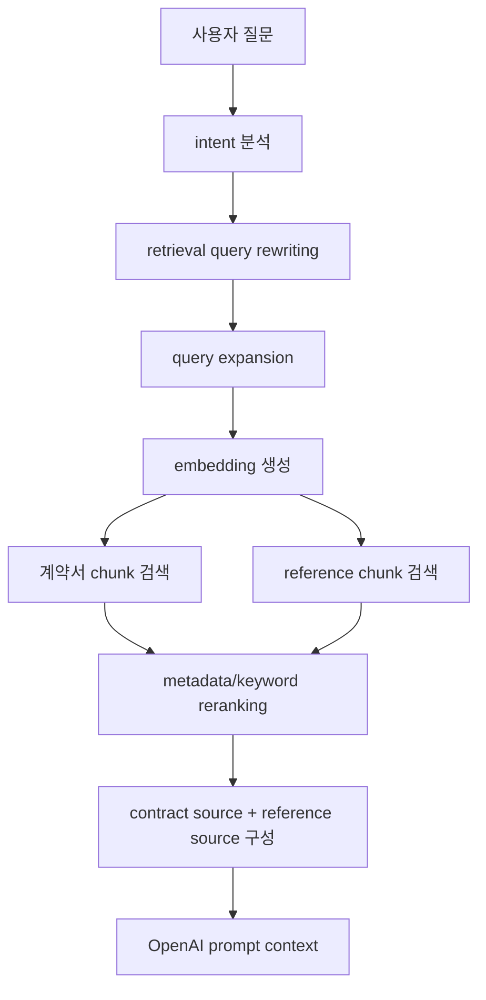
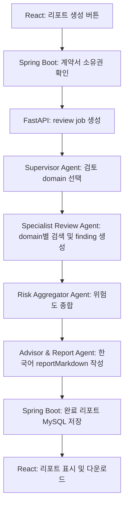

# LeaseGuard AI

## 1. 프로젝트 개요

**LeaseGuard AI**는 부동산 임대차계약서를 업로드하면 계약서의 주요 위험요소를 점검하고, 법령·공공 체크리스트·curated reference 문서를 근거로 질문에 답변하는 RAG 기반 AI 도우미이다.

본 프로젝트는 법률 자문 서비스를 목표로 하지 않는다. 계약 체결 여부, 계약 무효 여부, 위법 여부, 소송 승패를 단정하지 않고, 제공된 계약서와 reference source를 바탕으로 확인이 필요한 위험요소를 안내한다. 사용자는 이를 통해 임대인 또는 공인중개사에게 확인할 질문을 정리하고, 필요 시 전문가 상담으로 이어갈 수 있다.

### 1.1 서비스 포지셔닝

본 서비스는 “부동산 계약서 법률 조언 챗봇”이 아니라 “임대차계약서 위험요소를 법령·공공 체크리스트·curated reference와 비교해 점검하는 RAG 기반 AI 도우미”이다. 따라서 답변은 다음 원칙을 따른다.

- 계약서 조각과 reference source에 근거해 설명한다.
- sources에 없는 내용은 단정하지 않는다.
- 법률 판단이 필요한 질문에는 단정 대신 확인 가능 사항과 전문가 상담 권장을 제시한다.
- 모든 AI 답변은 “법률 자문이 아니라 참고용 위험 점검”이라는 한계를 유지한다.

### 1.2 MVP 범위

현재 MVP는 로그인 없이 익명 세션 기반으로 동작한다. `anonymousSessionId`를 브라우저 `localStorage`에 저장하고, 모든 Spring Boot API 요청에 `X-Anonymous-Session-Id` 헤더를 포함한다.

구현된 MVP 기능은 다음과 같다.

- 익명 세션 생성 및 브라우저 저장
- TXT/PDF 계약서 업로드
- 텍스트 추출 가능한 PDF 처리
- 계약서 chunking 및 ChromaDB 저장
- curated reference 문서 인덱싱
- OpenAI embedding 기반 hybrid retrieval
- rule-based 계약서 위험요소 분석 및 evidence 발췌
- RAG + OpenAI Chat API 기반 계약서 Q&A
- 구조화된 chat intent 기반 prompt routing
- 구조화된 chat memory summary 기반 후속 질문 보조
- 답변 본문 `[Source n]` citation과 source 토글 UI
- 채팅 기록 및 message sources 저장
- 이전 계약서 목록, 분석 결과, 채팅 복원
- 계약서 soft delete
- 브라우저 익명 세션 초기화
- Sequential Multi-Agent 종합 검토 리포트 생성
- 비동기 review job polling
- 완료된 sequential multi-agent report의 MySQL 저장 및 새로고침 복원
- Markdown, TXT, 브라우저 print 기반 PDF 다운로드

## 2. 기술 스택

| 영역 | 기술 |
| --- | --- |
| Frontend | React, Vite, CSS |
| Backend | Spring Boot, Java 17, Gradle, JPA |
| RAG Server | FastAPI, Python, Pydantic |
| Vector DB | ChromaDB |
| Database | MySQL |
| LLM | OpenAI Chat API |
| Embedding | OpenAI Embedding, local hash fallback |
| Infra | Docker, docker-compose |

## 3. 시스템 아키텍처



React는 OpenAI API 또는 FastAPI를 직접 호출하지 않는다. 모든 사용자 요청은 `React → Spring Boot → FastAPI → OpenAI API` 흐름을 따른다. Spring Boot는 세션 검증, 계약서 메타데이터, 분석 결과, 채팅 기록, 리포트 저장을 담당한다. FastAPI는 문서 파싱, 인덱싱, 검색, rule-based 분석, LLM prompt 구성, sequential multi-agent review를 담당한다.

## 4. 디렉터리 구조

```text
leaseguard-ai/
├── frontend/                 # React frontend
├── backend/                  # Spring Boot backend
├── rag-server/               # FastAPI RAG server
├── data/                     # 초기 샘플 및 reference 자료
├── docs/                     # 화면 캡처 등 문서 자료
├── docker-compose.yml
├── .env.example
├── TEST_COMMANDS.md
├── TEST_RAG_SEARCH.md
├── TEST_MULTI_AGENT.md
├── TEST_CHAT_MEMORY.md
├── TEST_CHAT_INTENT.md
└── README.md
```

FastAPI reference 자료는 다음 경로를 사용한다.

```text
rag-server/data/reference_sources/
├── curated/
└── source_manifest.json
```

## 5. 주요 기능

| 기능 | 구현 내용 |
| --- | --- |
| 익명 세션 | UUID 기반 `anonymousSessionId`를 생성하고 MySQL 및 브라우저 `localStorage`에 저장한다. |
| 계약서 업로드 | React에서 multipart 방식으로 TXT/PDF 파일을 업로드한다. |
| PDF 처리 | FastAPI가 `pypdf`를 사용해 텍스트 추출 가능한 PDF를 처리한다. 스캔본 PDF는 OCR 미지원 오류를 반환한다. |
| 계약서 인덱싱 | 추출된 계약서 텍스트를 chunk로 나누고 `user_contracts` collection에 저장한다. |
| reference 인덱싱 | curated reference 문서와 manifest metadata를 `legal_reference` collection에 저장한다. |
| 위험 분석 | rule 기반으로 보증금 반환, 특약, 수리비, 계약 해지, 관리비 등 확인 항목을 분석한다. |
| evidence 발췌 | 위험 항목과 관련된 계약서 원문 문장 또는 주변 문맥을 evidence로 제시한다. |
| RAG Q&A | 계약서 chunk와 reference chunk를 함께 검색해 OpenAI 답변을 생성한다. |
| hybrid retrieval | OpenAI embedding, local hash fallback, keyword coverage, metadata bonus, category reranking을 조합한다. |
| source citation | 답변 본문에 `[Source n]`을 표시하고, React에서 해당 번호의 source만 토글로 제공한다. |
| chat memory | 최근 메시지 8개만 전달하되, 긴 대화의 핵심 이슈를 구조화된 memory JSON으로 저장한다. |
| intent routing | `topic`, `answerStyle`, `safetyLevel`, `isFollowUp`을 분리해 prompt와 retrieval query rewriting에 사용한다. |
| Dashboard | 이전 계약서 목록, 분석 결과 재진입, 채팅 재진입, 삭제, 세션 초기화를 제공한다. |
| Sequential Multi-Agent Report | Supervisor, Specialist, Risk Aggregator, Advisor & Report Agent를 순차적으로 실행해 종합 검토 리포트를 생성한다. |
| Async Report Job | 리포트 생성을 job으로 시작하고 React가 progress를 polling한다. |
| Report Persistence | 완료된 리포트를 MySQL에 저장해 새로고침 후에도 복원한다. |
| Report Download | Markdown, TXT, 브라우저 print 기반 PDF 저장을 제공한다. |

## 6. 데이터 흐름

### 6.1 계약서 업로드 및 분석



### 6.2 RAG 채팅



### 6.3 Sequential Multi-Agent Report



## 7. RAG 구현

RAG는 Retrieval-Augmented Generation의 약어이다. 본 프로젝트에서는 “LLM이 기억하고 있는 일반 지식만으로 답하게 하는 방식”이 아니라, 먼저 계약서와 reference 문서에서 관련 문장을 검색한 뒤 그 검색 결과를 OpenAI에 함께 전달한다. 즉, 답변 생성 전에 근거 문장을 찾고, 그 근거 안에서만 답하도록 제한하는 구조이다.

LeaseGuard AI에서 RAG가 필요한 이유는 다음과 같다.

- 임대차계약서마다 문구와 특약이 다르므로, 사용자가 업로드한 계약서 원문을 직접 참조해야 한다.
- 법률·체크리스트 기준은 계약서 밖의 reference 문서에 있으므로, 계약서 문구와 기준 문서를 함께 비교해야 한다.
- 답변에 근거 source를 표시해야 하므로, 어떤 문장을 보고 답했는지 추적할 수 있어야 한다.
- 법률 판단을 단정하지 않기 위해 sources에 없는 내용을 만들지 않도록 통제해야 한다.

### 7.1 문서 가공 파이프라인

계약서와 reference 문서는 그대로 LLM에 넣지 않는다. 문서 전체를 한 번에 넣으면 길이가 길고, 질문과 관련 없는 내용까지 섞이기 때문이다. 따라서 문서를 작은 조각으로 나누고, 각 조각에 metadata를 붙여 검색 가능한 형태로 저장한다.



각 단계의 의미는 다음과 같다.

| 단계 | 설명 |
| --- | --- |
| 텍스트 추출 | TXT는 그대로 읽고, PDF는 `pypdf`로 텍스트를 추출한다. 스캔 PDF처럼 글자가 이미지로만 있는 경우 OCR이 필요하므로 현재 단계에서는 지원하지 않는다. |
| chunk 분할 | 긴 문서를 500~800자 내외의 작은 조각으로 나눈다. 이렇게 하면 “보증금 반환” 질문에 계약서 전체가 아니라 관련 조항만 검색할 수 있다. |
| metadata 부여 | 각 chunk에 문서 제목, sourceType, category, contractId, anonymousSessionId 같은 정보를 붙인다. 이 정보는 검색 필터링과 reranking에 사용한다. |
| embedding 생성 | 문장을 숫자 벡터로 바꾼다. 의미가 비슷한 문장끼리 가까운 벡터가 되므로, 키워드가 완전히 같지 않아도 관련 문장을 찾을 수 있다. |
| ChromaDB 저장 | chunk, metadata, embedding을 vector DB에 저장한다. 이후 질문이 들어오면 ChromaDB에서 관련 chunk를 빠르게 검색한다. |

### 7.2 ChromaDB collection

ChromaDB에는 두 종류의 collection을 둔다. collection은 비슷한 성격의 문서 조각을 담는 저장소라고 볼 수 있다.

| Collection | 저장 대상 | 주요 metadata | 분리 이유 |
| --- | --- | --- | --- |
| `legal_reference` | 법령, guide, checklist, standard contract reference | `category`, `sourceType`, `title`, `fileName`, `chunkIndex`, `keywords` | 모든 사용자가 공통으로 참조하는 기준 문서를 저장한다. |
| `user_contracts` | 사용자가 업로드한 계약서 chunk | `anonymousSessionId`, `contractId`, `documentName`, `chunkIndex` | 사용자별 계약서 원문을 저장한다. |

`user_contracts` 검색은 반드시 `anonymousSessionId`와 `contractId` 기반 filter를 사용한다. 이는 보안과 데이터 격리를 위한 핵심 조건이다. 예를 들어 A 사용자가 업로드한 계약서가 B 사용자의 질문 답변에 섞이면 안 되므로, 계약서 chunk 검색 시 현재 세션과 현재 계약서에 해당하는 chunk만 조회한다.

### 7.3 reference dataset과 metadata

현재 curated reference는 임대차계약서 MVP에서 자주 등장하는 위험 주제를 중심으로 구성한다.

- 보증금 반환
- 특약 조항
- 수리비 부담 및 원상복구
- 전입신고와 확정일자
- 등기부등본 및 선순위 권리 확인
- 전세사기 예방 체크리스트
- 표준계약서 기준 항목

reference 문서에는 단순 텍스트만 저장하지 않고, 검색 품질을 위해 metadata를 함께 저장한다.

```json
{
  "sourceType": "checklist",
  "category": "deposit_return",
  "title": "보증금 반환 확인 체크리스트",
  "fileName": "deposit_return_checklist.txt",
  "chunkIndex": 2,
  "keywords": "보증금, 반환, 계약 종료, 임차권등기명령"
}
```

이 metadata는 사용자가 “내 돈 못 받는 거야?”처럼 직접적인 법률 용어를 쓰지 않은 질문을 하더라도, 보증금 반환과 관련된 reference를 더 잘 찾도록 돕는다.

### 7.4 Hybrid retrieval

Hybrid retrieval은 여러 검색 방식을 조합한다는 의미이다. 한 가지 방식만 쓰면 놓치는 문장이 생기기 쉽다. 예를 들어 “보증금”이라는 단어가 정확히 들어간 문장을 찾는 것은 키워드 검색이 잘하지만, “돈을 돌려받는 시점”처럼 표현이 바뀐 질문은 의미 기반 검색이 더 잘 찾을 수 있다.

본 프로젝트의 검색은 다음 요소를 함께 사용한다.

| 요소 | 역할 |
| --- | --- |
| OpenAI embedding vector search | 질문과 의미가 비슷한 계약서/reference chunk를 찾는다. |
| local hash embedding fallback | OpenAI embedding 호출이 실패하거나 local 모드일 때 최소 검색 기능을 유지한다. |
| query expansion | “돌려받”, “내 돈”, “반환” 같은 표현을 `deposit_return` 관련 검색어로 확장한다. |
| category metadata reranking | 검색된 결과 중 질문 주제와 category가 맞는 source에 가산점을 준다. |
| keyword coverage score | 질문에 들어 있는 핵심 단어가 문서 내용이나 metadata에 얼마나 포함되는지 반영한다. |
| contract/reference source mix | 계약서 근거와 reference 근거가 함께 나오도록 구성한다. |
| reference title diversity | 같은 reference 문서만 반복해서 나오지 않도록 source 제목을 분산한다. |

검색 흐름은 다음과 같다.



OpenAI embedding은 `OPENAI_API_KEY`가 있고 `EMBEDDING_PROVIDER`가 `auto` 또는 `openai`일 때 사용한다. API 호출 실패 시 local hash embedding으로 fallback한다. 이 fallback은 품질은 낮을 수 있지만, 개발 환경에서 기능 흐름이 완전히 멈추지 않도록 하기 위한 장치이다.

### 7.5 source 가공 방식

검색 결과로 얻은 source는 사용자에게 그대로 모두 보여주지 않는다. 먼저 OpenAI prompt에는 번호가 붙은 sources 목록으로 전달한다.

```text
[Source 1]
sourceType: contract
sourceTitle: sample_contract.pdf
chunkText: 계약 종료 후 보증금을 반환한다...

[Source 2]
sourceType: checklist
sourceTitle: 보증금 반환 체크리스트
chunkText: 계약 종료일과 보증금 반환 시점을 명확히 확인해야 한다...
```

OpenAI는 답변에서 근거가 필요한 문장 뒤에 `[Source 1]`처럼 source 번호를 붙인다. React는 답변 본문에 실제로 언급된 source 번호만 화면에 표시한다. 이 방식의 장점은 다음과 같다.

- 답변과 무관한 source가 화면을 차지하지 않는다.
- 사용자는 답변 문장과 근거 문서를 번호로 쉽게 연결할 수 있다.
- source 본문이 길어도 기본 300자 preview만 보여주고, 필요할 때만 “더보기”로 펼칠 수 있다.
- 계약서 근거와 reference 근거를 분리해, “계약서에 실제로 적힌 내용”과 “체크리스트나 법령 기준”을 구분할 수 있다.

따라서 source는 내부적으로는 `answer` 생성에 쓰이는 근거이고, UI에서는 답변 본문에 citation으로 연결된 근거만 선택적으로 보여주는 자료이다.

### 7.6 Prompt routing

사용자의 질문은 항상 같은 형태가 아니다. “위험한 점 알려줘”는 분석 요청이고, “너무 어려운데 쉽게 말해줘”는 설명 방식 변경 요청이며, “이 계약 무효야?”는 법률 판단을 요구하는 민감한 질문이다. 따라서 FastAPI는 질문을 내부적으로 다음 네 가지 intent로 나눈다.

| 필드 | 의미 | 예시 |
| --- | --- | --- |
| `topic` | 질문의 계약 이슈 영역 | `deposit_return`, `registry_check` |
| `answerStyle` | 답변 방식과 톤 | `structured_analysis`, `brief_summary` |
| `safetyLevel` | 법률 판단 민감도 | `normal`, `legal_judgment_sensitive` |
| `isFollowUp` | 후속 질문 여부 | `true`, `false` |

이 intent는 사용자에게 노출하지 않는다. 내부적으로 retrieval query rewriting과 OpenAI prompt building에만 사용한다. 예를 들어 “임대인에게 뭐라고 물어보면 돼?”라는 질문은 `answerStyle=landlord_question`으로 처리되어, 사용자가 실제로 복사해 쓸 수 있는 질문 문장 중심의 답변을 생성한다.

### 7.7 Chat memory

Spring Boot는 현재 chat session의 최근 메시지 8개를 FastAPI에 전달한다. 하지만 대화가 길어지면 8개 이전의 중요한 맥락이 사라질 수 있다. 이를 보완하기 위해 `chat_sessions.memory_summary`에 구조화된 memory JSON을 저장한다.

```json
{
  "topic": "deposit_return_risk_check",
  "issueCategories": ["deposit_return", "repair_cost_restoration"],
  "latestUserConcern": "보증금 반환 시점과 수리비 부담 범위 확인",
  "recommendedNextActions": ["임대인에게 반환 시점을 문서로 확인", "특약 문구 수정 요청"]
}
```

이 memory는 “그럼?”, “그 조항은?”, “임대인에게 뭐라고 말해?” 같은 후속 질문에서 검색어를 보강하는 데 사용한다. 예를 들어 직전 대화의 핵심이 보증금 반환이었다면, “그럼 내가 현실적으로 할 수 있는 일은?”이라는 짧은 질문도 내부 검색에서는 보증금 반환, 반환 지연, 특약 확인 같은 단어를 함께 사용한다.

단, memory JSON과 rewritten query는 사용자에게 직접 보여주지 않는다. 사용자는 원문 질문을 그대로 보며, 시스템 내부에서만 검색 품질을 보완한다.

## 8. Sequential Multi-Agent Report

Sequential Multi-Agent Report는 채팅 답변보다 더 넓은 범위로 계약서를 종합 검토하기 위한 기능이다. 채팅은 사용자의 한 질문에 답하는 기능이고, sequential multi-agent report는 계약서 전체를 여러 관점에서 나누어 점검한 뒤 하나의 리포트로 합치는 기능이다.

여기서 “Agent”는 실제 독립된 사람이 아니라, 하나의 검토 역할을 담당하는 소프트웨어 모듈을 의미한다. 예를 들어 Supervisor Agent는 어떤 항목을 검토할지 정하고, Specialist Review Agent는 보증금 반환이나 수리비처럼 특정 영역을 집중 검토한다. 현재 구현은 agent들이 자율적으로 토론하거나 병렬 협상하는 구조가 아니라, 정해진 순서에 따라 실행되는 순차형 파이프라인이다.

### 8.1 전체 파이프라인

Sequential Multi-Agent Report는 다음 순서로 동작한다.



이 구조를 사용한 이유는 계약서 검토가 한 가지 기준으로 끝나지 않기 때문이다. 보증금 반환, 특약, 수리비, 전입신고, 등기부등본, 전세사기 예방은 서로 다른 확인 포인트를 갖는다. 하나의 큰 prompt로 모두 처리하면 항목이 누락되거나 설명이 흐려질 수 있으므로, domain별 검토 결과를 만든 뒤 최종 리포트로 합치는 방식을 사용한다.

### 8.2 Agent 구성

| Agent | 역할 | 산출물 |
| --- | --- | --- |
| Supervisor Agent | 검토할 domain 목록을 선택한다. | `selectedDomains` |
| Specialist Review Agent | 각 domain별로 계약서 source와 reference source를 검색하고 finding을 만든다. | `category`, `riskLevel`, `contractEvidence`, `recommendations` |
| Risk Aggregator Agent | domain별 findings를 종합해 전체 위험도와 핵심 위험을 정리한다. | `overallRiskLevel`, `summary`, `topRisks` |
| Advisor & Report Agent | 사용자가 읽을 수 있는 한국어 리포트 본문을 작성한다. | `reportMarkdown` |

검토 domain은 다음과 같다.

| Domain | 확인하는 내용 |
| --- | --- |
| `deposit_return` | 보증금 반환 시점, 반환 조건, 반환 지연 가능성 |
| `special_clause` | 임차인에게 불리하거나 과도한 특약 |
| `repair_cost` | 수리비, 수선 의무, 원상복구 부담 범위 |
| `move_in_fixed_date` | 전입신고, 확정일자, 대항력, 우선변제권 |
| `registry_check` | 등기부등본, 근저당, 압류, 선순위 권리 |
| `jeonse_fraud_prevention` | 전세사기 예방 체크리스트, 보증보험, 시세 확인 |
| `standard_contract` | 표준계약서 기준 필수 항목과 누락 가능성 |

### 8.3 Specialist Review의 source 가공

Specialist Review Agent는 domain별로 정해진 검색 query를 사용한다. 예를 들어 `deposit_return` domain은 보증금 반환, 계약 종료, 반환 지연, 임차권등기명령과 관련된 검색어를 사용한다.

각 domain 검토는 다음 과정을 따른다.

1. domain별 query를 만든다.
2. `user_contracts`에서 현재 계약서의 관련 chunk를 검색한다.
3. `legal_reference`에서 같은 domain의 reference chunk를 검색한다.
4. 계약서 chunk가 있으면 그중 가장 관련 높은 문장을 `contractEvidence`로 사용한다.
5. reference chunk는 `relatedSources`로 연결한다.
6. domain별 rule에 따라 `LOW`, `CAUTION`, `HIGH` 중 하나의 위험도를 부여한다.
7. 사용자가 확인해야 할 질문이나 행동을 `recommendations`로 정리한다.

예를 들어 보증금 반환 domain의 finding은 다음과 같은 구조가 된다.

```json
{
  "category": "deposit_return",
  "riskLevel": "CAUTION",
  "title": "보증금 반환 조건 확인 필요",
  "contractEvidence": "계약 종료 후 보증금을 반환한다.",
  "reason": "반환 시점이 구체적이지 않으면 분쟁 가능성이 있다.",
  "recommendations": [
    "계약 종료일에 반환되는지 확인한다.",
    "신규 임차인 입주 조건이 붙어 있는지 확인한다."
  ]
}
```

이 결과는 최종 사용자에게 그대로 노출되기보다, Risk Aggregator와 Advisor & Report Agent가 읽기 쉬운 리포트로 다시 정리한다.

### 8.4 Risk Aggregator와 최종 리포트

Risk Aggregator Agent는 domain별 finding을 모아 전체 위험도를 정한다. 현재 MVP에서는 전문적인 법률 판단이 아니라, 검색된 계약서 조항과 reference 근거의 존재 여부, domain별 rule 결과를 바탕으로 `SAFE`, `CAUTION`, `DANGER` 또는 이에 준하는 위험 수준을 구성한다.

Advisor & Report Agent는 종합 결과를 한국어 Markdown 리포트로 작성한다. 이때 다음 원칙을 유지한다.

- 사용자가 처음 계약서를 읽는 사람이라고 가정한다.
- 어려운 표현은 쉬운 말로 풀어 설명한다.
- 계약서에서 확인된 내용과 reference 기준을 구분한다.
- “위험하다”로 단정하기보다 “확인이 필요하다”는 방식으로 표현한다.
- 최종 법률 판단이 필요한 경우 전문가 상담을 권장한다.

### 8.5 Async job 구조

Sequential Multi-Agent Report는 일반 채팅보다 시간이 더 걸릴 수 있다. 여러 domain을 검색하고, findings를 종합하고, 리포트 본문을 작성하기 때문이다. 따라서 사용자가 버튼을 누른 즉시 최종 결과를 기다리게 하지 않고, job을 생성한 뒤 진행률을 조회하는 구조를 사용한다.

FastAPI는 `/rag/contracts/review-jobs`로 review job을 시작하고, `/rag/contracts/review-jobs/{jobId}`로 상태를 조회한다. Spring Boot는 이를 `/api/v1/contracts/{contractId}/review-jobs`와 `/api/v1/contracts/{contractId}/review-jobs/{jobId}`로 중계한다.

상태값은 다음과 같다.

| 상태 | 의미 |
| --- | --- |
| `PENDING` | job이 생성되었고 실행을 준비 중이다. |
| `RUNNING` | agent 검토와 리포트 생성이 진행 중이다. |
| `COMPLETED` | 리포트 생성이 완료되었다. |
| `FAILED` | 계약서 chunk 없음, ChromaDB 오류, 처리 실패 등으로 job이 실패했다. |

진행률은 대략 다음 기준으로 갱신한다.

| progress | 의미 |
| --- | --- |
| 10 | job 시작 |
| 25 | Supervisor 단계 완료 |
| 50 | Specialist Review 단계 완료 |
| 75 | Risk Aggregation 단계 완료 |
| 90 | Report 작성 중 |
| 100 | 완료 |

React는 이 progress 값을 polling해 “분석 준비 중”, “전문 에이전트 검토 중”, “위험도 종합 중”, “리포트 작성 중”, “완료”와 같은 문구로 보여준다.

### 8.6 저장과 복원

초기 FastAPI job store는 in-memory로 동작할 수 있으므로 서버 재시작 시 job 자체는 사라질 수 있다. 이를 보완하기 위해 Spring Boot는 완료된 리포트를 MySQL `contract_review_reports` 테이블에 저장한다.

저장되는 주요 정보는 다음과 같다.

- `jobId`
- `status`
- `overallRiskLevel`
- `summary`
- `reportMarkdown`
- `agentResultsJson`
- `sourcesJson`
- `createdAt`
- `updatedAt`

사용자가 분석 결과 화면을 새로고침하면 React는 `/api/v1/contracts/{contractId}/review-report`를 호출해 저장된 최신 리포트를 다시 불러온다. 따라서 job store가 사라져도 이미 완료되어 DB에 저장된 리포트는 복원할 수 있다.

### 8.7 Report UI

분석 결과 화면은 다음 요소를 제공한다.

- 전체 위험도
- summary
- 접기/펼치기 가능한 reportMarkdown 본문
- agent trace 접이식 영역
- sources 접이식 영역
- Markdown 다운로드
- TXT 다운로드
- 브라우저 print 기반 PDF 저장

리포트 본문은 길어질 수 있으므로 기본 화면에서는 요약과 위험도를 먼저 보여주고, 본문은 접기/펼치기 형태로 제공한다. sources도 기본 접힘 상태로 두어, 사용자가 필요할 때 근거 문장을 확인하도록 한다.

## 9. Backend API

공통 요청 헤더는 다음과 같다.

```http
X-Anonymous-Session-Id: {anonymousSessionId}
```

| Method | Endpoint | 설명 |
| --- | --- | --- |
| POST | `/api/v1/anonymous-sessions` | 익명 세션을 생성한다. |
| POST | `/api/v1/contracts` | 계약서를 업로드하고 분석한다. |
| GET | `/api/v1/contracts` | 현재 익명 세션의 계약서 목록을 조회한다. |
| GET | `/api/v1/contracts/{contractId}` | 계약서 상세 정보를 조회한다. |
| GET | `/api/v1/contracts/{contractId}/analysis` | 계약서 분석 결과를 조회한다. |
| DELETE | `/api/v1/contracts/{contractId}` | 계약서를 soft delete한다. |
| POST | `/api/v1/contracts/{contractId}/review-jobs` | sequential multi-agent review job을 시작한다. |
| GET | `/api/v1/contracts/{contractId}/review-jobs/{jobId}` | review job 상태와 결과를 조회한다. |
| GET | `/api/v1/contracts/{contractId}/review-report` | 저장된 최신 종합 리포트를 조회한다. |
| POST | `/api/v1/chat-sessions` | 채팅 세션을 생성한다. |
| GET | `/api/v1/chat-sessions` | 채팅 세션 목록을 조회한다. |
| GET | `/api/v1/chat-sessions/{chatSessionId}/messages` | 저장된 메시지 목록을 조회한다. |
| POST | `/api/v1/chat-sessions/{chatSessionId}/messages` | 사용자 메시지를 저장하고 RAG 답변을 생성한다. |

## 10. FastAPI API

| Method | Endpoint | 설명 |
| --- | --- | --- |
| GET | `/health` | RAG 서버 상태를 확인한다. |
| POST | `/rag/references/index` | curated reference 문서를 인덱싱한다. |
| POST | `/rag/contracts/index` | 계약서를 인덱싱하고 rule-based 분석을 수행한다. |
| POST | `/rag/chat` | RAG 검색과 OpenAI 답변 생성을 수행한다. |
| POST | `/rag/contracts/review` | 동기 sequential multi-agent report를 생성한다. |
| POST | `/rag/contracts/review-jobs` | 비동기 sequential multi-agent review job을 시작한다. |
| GET | `/rag/contracts/review-jobs/{jobId}` | 비동기 review job 상태와 결과를 조회한다. |

## 11. Database

주요 테이블은 다음과 같다.

| 테이블 | 역할 |
| --- | --- |
| `anonymous_sessions` | 익명 세션 정보를 저장한다. |
| `contracts` | 계약서 메타데이터와 상태를 저장한다. |
| `contract_analysis_results` | rule-based 분석 결과를 저장한다. |
| `chat_sessions` | 채팅 세션과 structured memory summary를 저장한다. |
| `chat_messages` | 사용자 및 assistant 메시지를 저장한다. |
| `message_sources` | assistant 답변에 연결된 sources를 저장한다. |
| `contract_review_reports` | 완료된 sequential multi-agent 종합 리포트를 저장한다. |

개발 환경에서는 JPA `ddl-auto=update`를 사용해 필요한 테이블 변경을 반영한다.

## 12. 실행 방법

### 12.1 사전 요구사항

- Java 17
- Node.js 및 npm
- Python 3.x
- Docker Desktop
- OpenAI API key

### 12.2 환경 변수

루트의 `.env.example`을 참고해 `.env` 또는 각 실행 환경 변수를 구성한다.

```env
# MySQL
MYSQL_ROOT_PASSWORD=root
MYSQL_DATABASE=leaseguard
MYSQL_USER=leaseguard
MYSQL_PASSWORD=leaseguard123

# Spring Boot
SPRING_DATASOURCE_URL=jdbc:mysql://localhost:3306/leaseguard
SPRING_DATASOURCE_USERNAME=leaseguard
SPRING_DATASOURCE_PASSWORD=leaseguard123
RAG_SERVER_BASE_URL=http://localhost:8000

# FastAPI
OPENAI_API_KEY=your_openai_api_key
OPENAI_MODEL=gpt-4o-mini
EMBEDDING_PROVIDER=auto
OPENAI_EMBEDDING_MODEL=text-embedding-3-small
OPENAI_EMBEDDING_DIMENSIONS=128
CHROMA_HOST=localhost
CHROMA_PORT=8001
```

OpenAI API key는 frontend에 노출하지 않는다.

### 12.3 MySQL 및 ChromaDB 실행

```powershell
docker compose up -d mysql chromadb
```

MySQL은 `localhost:3306`, ChromaDB는 `localhost:8001`을 사용한다.

### 12.4 FastAPI 실행

```powershell
cd rag-server
.\.venv\Scripts\Activate.ps1
pip install -r requirements.txt
uvicorn app.main:app --reload --port 8000
```

### 12.5 Backend 실행

```powershell
cd backend
.\gradlew.bat bootRun
```

Backend 기본 포트는 `8080`이다.

### 12.6 Frontend 실행

```powershell
cd frontend
npm.cmd install
npm.cmd run dev
```

Frontend 기본 포트는 `5173`이다. PowerShell에서는 `npm` 대신 `npm.cmd` 사용을 권장한다.

### 12.7 reference 인덱싱

FastAPI 실행 후 다음 API를 호출해 reference 문서를 인덱싱한다.

```powershell
Invoke-RestMethod -Method Post -Uri "http://localhost:8000/rag/references/index"
```

## 13. 테스트 문서

| 문서 | 내용 |
| --- | --- |
| `TEST_COMMANDS.md` | PowerShell 기반 주요 API 테스트 명령을 정리한다. |
| `TEST_RAG_SEARCH.md` | RAG 검색 회귀 테스트와 Hit@3, Noise count, source mix 기준을 정리한다. |
| `TEST_MULTI_AGENT.md` | sequential multi-agent report 및 async job 테스트를 정리한다. |
| `TEST_CHAT_MEMORY.md` | structured chat memory summary 테스트를 정리한다. |
| `TEST_CHAT_INTENT.md` | structured chat intent routing 테스트를 정리한다. |

## 14. 검증 항목

개발 과정에서 다음 항목을 검증했다.

| 검증 항목 | 결과 |
| --- | --- |
| Spring Boot `compileJava` | 성공 |
| React `npm.cmd run build` | 성공 |
| FastAPI `python -m compileall app` | 성공 |
| FastAPI app import | 성공 |
| `/rag/references/index` | 성공 |
| `/rag/contracts/index` | 성공 |
| `/rag/chat` fallback | 성공 |
| `/rag/chat` OpenAI 호출 | 성공 |
| OpenAI embedding reindex | 성공 |
| 22개 RAG 검색 회귀 테스트 | 성공 |
| 계약서 soft delete 후 목록 제외 | 성공 |
| 삭제된 계약서 접근 차단 | 성공 |
| sequential multi-agent review job 생성 및 polling | 성공 |
| completed report DB 저장 및 복원 | 성공 |
| report Markdown/TXT/PDF 다운로드 | 성공 |

## 15. 트러블슈팅

| 문제 | 원인 및 해결 |
| --- | --- |
| PowerShell에서 `curl` 동작이 예상과 다름 | PowerShell alias 문제이므로 `curl.exe` 또는 `Invoke-RestMethod`를 사용한다. |
| PowerShell 5에서 한글이 `?`로 표시됨 | 콘솔 입출력 인코딩 문제이다. API JSON과 React 화면은 UTF-8 기준으로 처리한다. |
| `vite` command not found | `frontend`에서 `npm.cmd install`을 먼저 실행한다. |
| npm 실행 정책 문제 | PowerShell에서는 `npm.cmd`를 사용한다. |
| port `8080` already in use | 기존 Spring Boot 프로세스를 종료하거나 port를 변경한다. |
| ChromaDB telemetry warning | 기능 동작에는 영향이 없는 경고이다. |
| `message_sources.source_type` 길이 초과 | DB column 길이를 확장하고 FastAPI `sourceType`을 정규화했다. |
| 스캔 PDF 업로드 실패 | OCR은 현재 구현하지 않았으므로 텍스트 추출 가능한 PDF만 지원한다. |
| OpenAI API 호출 실패 | `OPENAI_API_KEY`, billing, network 접근 가능 여부를 확인한다. 실패 시 fallback 답변을 사용한다. |
| embedding provider 혼동 | `EMBEDDING_PROVIDER=auto`는 OpenAI key가 있으면 OpenAI embedding을 사용하고 실패 시 local hash로 fallback한다. |

## 16. 현재 한계

- 스캔 PDF 및 이미지 파일 OCR은 지원하지 않는다.
- reference 문서는 MVP 검증용 curated dataset 중심이다.
- 실제 등기부등본 OCR 분석, 시세 API, 보증보험 가입 가능성 자동 판단은 구현하지 않았다.
- 익명 세션은 브라우저 `localStorage` 기반이므로 브라우저 변경 시 기존 목록 접근이 어렵다.
- 실제 서비스 배포, 인증, rate limit, 운영 보안 hardening은 구현 범위 밖이다.
- sequential multi-agent domain review는 rule과 retrieval 기반 1차 구조이며, 법률 전문가 검토를 대체하지 않는다.

## 17. 향후 발전 방향

- OCR 기반 스캔 PDF 및 이미지 계약서 처리
- 등기부등본 OCR 분석 및 권리관계 자동 점검
- 주소 기반 시세 및 실거래가 비교
- 보증보험 가입 가능성 확인 보조
- reference 문서 확장 및 최신 법령 source 관리
- 위험도 scoring 고도화
- clauseType 자동 분류 고도화
- 사용자 계정 기반 문서 관리
- 배포 환경 구성 및 보안 강화
- 변호사 또는 공인중개사 상담 연계

## 18. 결론

본 프로젝트는 임대차계약서 위험 점검 문제를 RAG 검색, OpenAI 답변 생성, Spring Boot 기반 데이터 저장, React UI로 연결한 MVP이다. 특히 계약서 chunk와 curated reference를 분리 저장하고, 계약서 검색에는 익명 세션과 계약서 ID filter를 적용해 사용자 간 데이터 혼입을 방지했다.

또한 단순 Q&A를 넘어 structured chat memory, structured intent routing, cited source UI, Sequential Multi-Agent Report를 구현했다. 이를 통해 사용자는 계약서의 위험요소를 질문하고, 근거 source를 확인하며, 종합 검토 리포트를 저장·공유할 수 있다.

다만 본 시스템은 법률 자문을 제공하지 않는다. LeaseGuard AI는 계약서에서 확인이 필요한 위험요소와 질문을 정리하는 참고용 도구이며, 최종 판단이 필요한 경우 전문가 상담이 필요하다.
