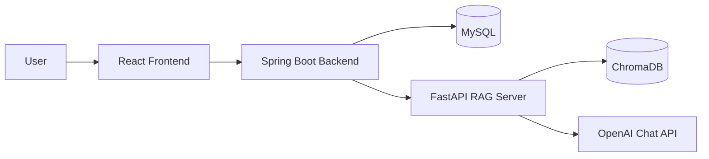
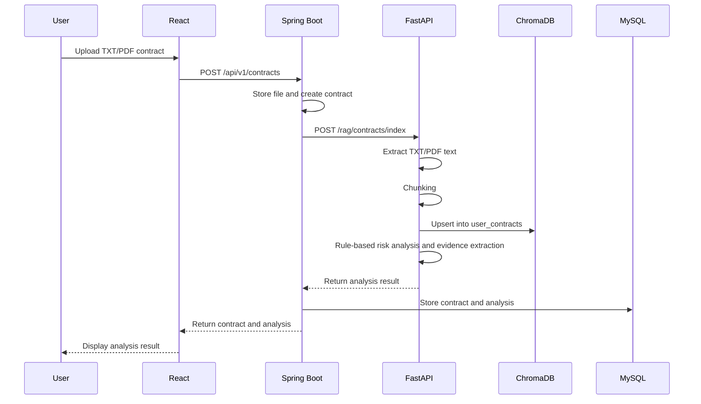
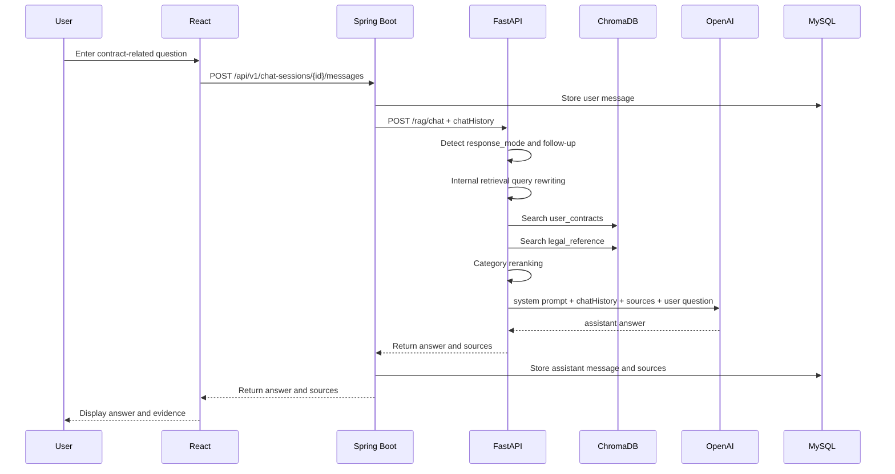

# LeaseGuard AI

## 1. Project Overview

**LeaseGuard AI** is a RAG-based AI assistant that checks key risk factors in real estate lease agreements and answers user questions based on statutes, public checklists, and curated reference documents.

The purpose of this project is to help non-legal users understand key clauses in lease agreements and organize questions that should be confirmed with a landlord or licensed real estate agent. In particular, the service provides reference-based risk checks around items such as deposit return, special clauses, repair cost responsibility, move-in registration and fixed date, registry record review, and jeonse fraud prevention checklists.

This service is not a legal advisory service. It does not determine whether a contract should be signed, whether a contract is invalid, whether a clause is illegal, or whether litigation would succeed. The answers provided by this system are reference-based risk checks grounded in contract snippets and reference sources, and expert consultation is recommended when final judgment is required.

### 1.1 Planning Background

Lease agreements often contain legal terms and practical expressions that are difficult for general users to understand. Deposit return timing, tenant repair cost responsibility, special clauses, move-in registration and fixed date, and senior rights shown in registry records are representative confirmation items that may lead to disputes after contract execution.

LeaseGuard AI extracts relevant sentences from an uploaded contract, searches them together with reference documents stored in ChromaDB, and generates an answer through the OpenAI Chat API. The answer includes sources so that the user can verify the supporting sentences.

### 1.2 MVP Scope

The current MVP operates with a non-login anonymous session model. Membership registration, JWT authentication, automated registry OCR verification, market price API integration, and automatic guarantee insurance eligibility judgment have not been implemented.

The implemented MVP scope is as follows.

- Anonymous session creation and `localStorage` storage
- TXT/PDF contract upload
- Text-extractable PDF processing
- Contract chunking and ChromaDB storage
- Curated reference document indexing
- Rule-based contract risk item analysis
- Contract source text evidence extraction
- RAG-based contract Q&A
- OpenAI Chat API-based answer generation
- Response mode-based answer strategy adjustment
- Recent conversation context delivery
- Answer source display
- Chat history and source storage
- Previous contract list retrieval, analysis revisit, and chat restoration
- Contract soft delete
- Browser anonymous session reset

## 2. Key Features

| Feature | Implementation |
| --- | --- |
| Anonymous session | Creates a UUID-based `anonymousSessionId` without login and stores it in browser `localStorage`. |
| Contract upload | Uploads TXT/PDF files from React through multipart form data, and Spring Boot stores the file. |
| PDF text extraction | FastAPI processes text-extractable PDF files with `pypdf`. Scanned PDFs return an OCR-not-supported error. |
| Contract indexing | Splits contract text into chunks and stores them in the ChromaDB `user_contracts` collection. |
| Reference indexing | Reads curated reference documents and manifest metadata, then stores them in the ChromaDB `legal_reference` collection. |
| Risk analysis | Performs rule-based checks for deposit return, special clauses, repair costs, contract termination, and management fees. |
| Evidence display | Extracts related sentences or surrounding context from the contract source text for each risk item. |
| RAG search | Searches contract chunks and reference chunks together and applies category-based reranking. |
| OpenAI answer | Generates answers through the OpenAI Chat API based on retrieved sources and chatHistory. |
| Response mode | Applies answer strategies such as easy explanation, analogy, landlord question phrasing, brief summary, clause rewrite example, and legal judgment refusal. |
| Chat restoration | Reloads stored chat sessions and messages to display previous conversations. |
| Dashboard | Retrieves previous contracts by anonymous session and supports analysis revisit or chat revisit. |
| Contract deletion | Soft-deletes contracts from the Dashboard and excludes them from the visible list. |

## 3. Screen Examples

Actual screenshot files can be stored later under `docs/screenshots/`. This README keeps placeholder paths for report structure.

### 3.1 Contract Upload Screen


The user selects and uploads a TXT/PDF contract file. After upload, Spring Boot requests contract indexing and analysis from the FastAPI RAG server.

### 3.2 Analysis Result Screen


The screen displays overall risk level, summary, risk items, descriptions, and contract source text evidence. The user can move directly from the analysis result to the chat screen.

### 3.3 RAG Chat Screen


The screen displays user questions and assistant answers. Assistant answers preserve line breaks, and contract evidence and reference evidence are separated as sources.

### 3.4 Dashboard Screen


The Dashboard displays the list of uploaded contracts for the anonymous session. Each contract provides analysis result viewing, question asking, and deletion features.

### 3.5 Response Mode Example Screen


This screen can show how answer strategies change depending on user intent, such as easy explanation, analogy, landlord question phrasing, or brief summary.

## 4. System Architecture



### 4.1 Component Roles

| Component | Role |
| --- | --- |
| React Frontend | Provides contract upload, analysis result, chat, and Dashboard UI. |
| Spring Boot Backend | Stores anonymous sessions, contract metadata, analysis results, chat sessions, messages, and sources in MySQL. |
| FastAPI RAG Server | Performs contract text extraction, chunking, ChromaDB indexing, RAG search, and OpenAI calls. |
| ChromaDB | Stores and searches reference chunks and contract chunks through the `legal_reference` and `user_contracts` collections. |
| MySQL | Stores anonymous sessions, contracts, analysis results, chat history, and message sources. |
| OpenAI Chat API | Generates natural-language answers based on retrieved sources and chatHistory. |

React does not call the OpenAI API or FastAPI directly. All requests follow the `React → Spring Boot → FastAPI → OpenAI API` flow.

## 5. Data Flow

### 5.1 Contract Upload and Analysis Flow



### 5.2 Reference Document Indexing Flow

1. FastAPI reads documents from `rag-server/data/reference_sources/curated`.
2. It loads `source_manifest.json` and builds metadata such as category, sourceType, and keywords.
3. It splits documents into character-length-based chunks.
4. It creates stable ids and upserts chunks into the ChromaDB `legal_reference` collection.
5. It prevents excessive duplicate storage even when the same documents are indexed again.

### 5.3 Chat/RAG Answer Flow



## 6. AI/RAG Implementation Details

### 6.1 Reason for Applying RAG

This project does not directly train the model on statutes and checklists. Instead, it stores reference documents in ChromaDB and retrieves related chunks when a question is asked. This RAG approach is suitable for providing source-based explanations and controlling the model so that it does not assert content outside the provided materials.

### 6.2 Reference Dataset

Reference documents consist of curated txt files and a manifest.

```text
rag-server/data/reference_sources/
├── curated/
└── source_manifest.json
```

The current reference documents cover the following topics.

- Deposit return
- Special clauses
- Repair cost responsibility and restoration
- Move-in registration and fixed date
- Registry records and senior rights review
- Jeonse fraud prevention checklist
- Standard contract criteria

### 6.3 ChromaDB Collections

| Collection | Stored Data | Main Metadata |
| --- | --- | --- |
| `legal_reference` | Statutes, guides, checklists, and standard contract reference documents | `category`, `sourceType`, `title`, `fileName`, `chunkIndex`, `keywords` |
| `user_contracts` | Contract chunks uploaded by users | `anonymousSessionId`, `contractId`, `documentName`, `chunkIndex` |

Searches against `user_contracts` always use filters based on `anonymousSessionId` and `contractId`. This isolates user contract chunks so that another user's contract cannot be mixed into search results.

### 6.4 Search Quality Improvements

The current RAG search uses the following techniques.

- Character-length-based chunking
- Custom hash/token n-gram-based embedding
- Query expansion
- Category metadata-based reranking
- Contract/reference source mix preservation
- Search quality checks based on test questions

OpenAI embedding is not currently used. LangChain is also not used in the current MVP.

### 6.5 OpenAI Answer Generation

FastAPI builds sources from ChromaDB search results and passes them to the OpenAI Chat API. The default model is `gpt-4o-mini`, and it can be changed through the `OPENAI_MODEL` environment variable.

OpenAI call conditions are as follows.

- If `OPENAI_API_KEY` exists, the OpenAI Chat API is called.
- If the API key is missing or the call fails, a template fallback answer is returned.
- The fallback answer also preserves the message that the response is a reference-based risk check, not legal advice.
- If no sources exist, the answer states that it is difficult to confirm based only on the provided materials.

### 6.6 LeaseGuard AI Persona

LeaseGuard AI does not make final judgments like a legal expert. It explains difficult clauses in plain language and helps users organize questions to ask a landlord or licensed real estate agent.

The answer principles are as follows.

- Answers are grounded in contract snippets and reference sources.
- Content not present in sources is not asserted.
- Contract invalidity, illegality, litigation outcome, or contract signing possibility is not determined.
- Expert consultation is recommended when necessary.
- The answer includes the meaning that it is a reference-based risk check, not legal advice.

### 6.7 Response Mode-Based Prompt Routing

`response_mode` is not a fixed output template. It is used as a hint that determines the answer strategy and tone.

| response_mode | Purpose |
| --- | --- |
| `structured_analysis` | Default risk analysis answer |
| `easy_explanation` | Easy explanation |
| `analogy` | Analogy or example-centered explanation |
| `landlord_question` | Suggested sentences to ask the landlord |
| `brief_summary` | Short key summary |
| `rewrite_clause` | Clause revision direction and reference example wording |
| `legal_judgment_refusal` | Avoidance of final legal judgment and guidance on confirmation items |

### 6.8 Conversation Context Maintenance

Spring Boot passes recent messages to FastAPI as `chatHistory`. FastAPI includes them in OpenAI messages so that follow-up questions such as “that part,” “the clause mentioned earlier,” or “what should I do then” can be interpreted according to the previous conversation flow.

FastAPI also performs internal retrieval query rewriting. This process does not change the original user question shown to the user, and it is used only internally for ChromaDB search and OpenAI prompt construction.

## 7. Backend Implementation Details

The Backend is a Spring Boot-based API server. It acts as the middle layer between React and FastAPI, and it handles data persistence and user request validation.

### 7.1 Package Roles

| Package | Role |
| --- | --- |
| `anonymous` | Anonymous session creation and retrieval |
| `contract` | Contract upload, list retrieval, detail retrieval, analysis result retrieval, and soft delete |
| `chat` | Chat session creation, message storage, source storage, and chatHistory delivery |
| `rag` | FastAPI RAG server client and DTOs |
| `global` | Common response, exception handling, and configuration |

### 7.2 Main APIs

| Method | Endpoint | Description |
| --- | --- | --- |
| POST | `/api/v1/anonymous-sessions` | Create anonymous session |
| POST | `/api/v1/contracts` | Upload and analyze contract |
| GET | `/api/v1/contracts` | Retrieve contract list |
| GET | `/api/v1/contracts/{contractId}` | Retrieve contract details |
| GET | `/api/v1/contracts/{contractId}/analysis` | Retrieve analysis result |
| DELETE | `/api/v1/contracts/{contractId}` | Soft-delete contract |
| POST | `/api/v1/chat-sessions` | Create chat session |
| GET | `/api/v1/chat-sessions` | Retrieve chat session list |
| GET | `/api/v1/chat-sessions/{chatSessionId}/messages` | Retrieve message list |
| POST | `/api/v1/chat-sessions/{chatSessionId}/messages` | Send message and generate RAG answer |

## 8. FastAPI RAG Server Implementation Details

FastAPI handles contract analysis and RAG search.

| Method | Endpoint | Description |
| --- | --- | --- |
| GET | `/health` | Check RAG server status |
| POST | `/rag/references/index` | Index reference documents |
| POST | `/rag/contracts/index` | Index contract and perform rule-based analysis |
| POST | `/rag/chat` | Perform RAG search and generate OpenAI answer |

### 8.1 Main Service Files

| File | Role |
| --- | --- |
| `contract_parser.py` | TXT/PDF text extraction |
| `chunking_service.py` | Document chunking |
| `reference_indexing_service.py` | Reference document indexing |
| `contract_indexing_service.py` | Contract indexing |
| `retrieval_service.py` | ChromaDB search, query expansion, and reranking |
| `llm_service.py` | OpenAI call, response mode, fallback, and prompt construction |
| `risk_analysis_service.py` | Rule-based risk item analysis and evidence extraction |
| `chroma_client.py` | ChromaDB client and collection management |

## 9. Frontend Implementation Details

The Frontend is implemented with React and Vite. It uses minimal styling while keeping the interface suitable for feature verification.

| Screen | Feature |
| --- | --- |
| Home | Service introduction and upload start |
| ContractUpload | TXT/PDF contract upload and analysis request |
| Analysis | Risk level, summary, risk items, and evidence display |
| Chat | Chat messages, assistant answer, and sources display |
| Dashboard | Previous contract list, analysis revisit, chat revisit, deletion, and session reset |

The Frontend stores `anonymousSessionId` in `localStorage` and includes the `X-Anonymous-Session-Id` header in all API requests.

## 10. Execution Guide

### 10.1 Prerequisites

- Java 17
- Node.js and npm
- Python 3.x
- Docker Desktop
- OpenAI API key

### 10.2 Environment Variables

Configure `.env` based on `.env.example` in the project root.

```env
# MySQL
MYSQL_ROOT_PASSWORD=root
MYSQL_DATABASE=leaseguard
MYSQL_USER=leaseguard
MYSQL_PASSWORD=leaseguard123

# Spring Boot
SPRING_DATASOURCE_URL=jdbc:mysql://localhost:3306/leaseguard
SPRING_DATASOURCE_USERNAME=leaseguard
SPRING_DATASOURCE_PASSWORD=leaseguard123
RAG_SERVER_BASE_URL=http://localhost:8000

# FastAPI
OPENAI_API_KEY=your_openai_api_key
OPENAI_MODEL=gpt-4o-mini
CHROMA_HOST=localhost
CHROMA_PORT=8001
```

The actual `.env` file is not included in Git. The OpenAI API key is not exposed to the frontend.

### 10.3 Run MySQL and ChromaDB

```powershell
docker compose up -d mysql chromadb
```

MySQL uses host `localhost` and port `3306`. ChromaDB uses host `localhost` and port `8001`.

### 10.4 Run Backend

```powershell
cd backend
.\gradlew.bat bootRun
```

The default Backend port is `8080`.

### 10.5 Run FastAPI

```powershell
cd rag-server
.\.venv\Scripts\Activate.ps1
pip install -r requirements.txt
uvicorn app.main:app --reload --port 8000
```

The default FastAPI port is `8000`.

### 10.6 Run Frontend

```powershell
cd frontend
npm.cmd install
npm.cmd run dev
```

The default Frontend port is `5173`. If PowerShell has execution issues, use `npm.cmd` instead of `npm`.

## 11. Test Scenarios

### 11.1 Contract Upload and Analysis

1. Create an anonymous session.
2. Upload a TXT contract or a text-extractable PDF contract.
3. Spring Boot calls FastAPI `/rag/contracts/index`.
4. FastAPI extracts contract text and stores it in ChromaDB.
5. FastAPI returns rule-based analysis results and evidence.
6. React displays risk items on the analysis result screen.

### 11.2 RAG Chat

Example questions are as follows.

- What is the riskiest part of this contract?
- Check whether the deposit return condition is risky.
- Are there any special clauses that are unfavorable to the tenant?
- Why are move-in registration and fixed date necessary?
- What should be checked in the registry record?

### 11.3 Follow-up Questions

An example question flow is as follows.

1. What is the riskiest part of this contract?
2. Then what can I realistically do?
3. How should I ask the landlord about the clause mentioned earlier?
4. How should that clause be revised?

### 11.4 Response Mode

Example questions are as follows.

- This is too difficult. Explain it simply.
- Explain it using an analogy.
- What should I ask the landlord?
- Tell me only the key points briefly.
- How should I revise this clause?
- Is this contract invalid? Would I win if I sued?

## 12. Verification Results

The following items were verified during development.

| Verification Item | Result |
| --- | --- |
| Spring Boot compile | Success |
| React build | Success |
| FastAPI compileall | Success |
| FastAPI app import | Success |
| `/rag/references/index` | Success |
| `/rag/contracts/index` | Success |
| `/rag/chat` fallback | Success |
| `/rag/chat` OpenAI call | Success |
| Contract excluded from list after deletion | Success |
| Deleted contract analysis and chat access blocked | Success |
| New anonymous session created after session reset | Success |

Detailed API test commands are documented in `TEST_COMMANDS.md` and `TEST_RAG_SEARCH.md`.

## 13. Troubleshooting

| Issue | Cause and Resolution |
| --- | --- |
| `curl` behaves unexpectedly in PowerShell | Use `curl.exe` or `Invoke-RestMethod` because of PowerShell alias behavior. |
| Korean text appears as `?` in PowerShell 5 | This is a console input/output encoding issue. React and API JSON are processed normally with UTF-8. |
| `vite` command not found | Run `npm.cmd install` in the `frontend` directory first. |
| npm execution policy issue | Use `npm.cmd` in PowerShell. |
| port `8080` already in use | Terminate the existing Spring Boot process or change the port. |
| ChromaDB telemetry warning | This warning does not affect functional behavior. |
| `message_sources.source_type` length exceeded | The DB column length was expanded and FastAPI `sourceType` was normalized. |
| Scanned PDF upload failure | OCR is not implemented, so only text-extractable PDFs are supported. |
| OpenAI API call failure | Check `OPENAI_API_KEY`, billing status, and network availability. |

## 14. Current Limitations

- Scanned PDF and image OCR are not supported.
- OpenAI embedding is not used.
- LangChain and LangSmith are not currently used.
- The reference document scope is centered on the MVP validation curated dataset.
- Legal judgment is not finalized.
- Anonymous sessions are based on browser `localStorage`, so accessing previous lists becomes difficult when the browser changes.
- Actual service deployment, authentication, rate limiting, and security hardening have not been implemented.
- Automated registry verification, market price comparison, and guarantee insurance eligibility judgment have not been implemented.

## 15. Future Development Directions

- OCR-based processing for scanned PDF and image contracts
- Review of OpenAI embedding or Korean sentence-transformers-based semantic embedding
- Expansion of statute article-level references
- Improvement of source citation UI
- Automatic clauseType classification by contract clause
- Advanced risk scoring
- User account-based document management
- Deployment environment configuration and security hardening
- Registry record OCR analysis
- Address-based market price and transaction price comparison
- Connection to lawyer or licensed real estate agent consultation

## 16. Retrospective

This project confirmed that RAG search quality and metadata design affect answer quality more directly than a simple LLM call. How reference documents are chunked and what categories and keywords are assigned significantly influences search results and source quality.

In the legal domain, safe persona design and source-based explanations are more important than assertive answers. LeaseGuard AI was designed not to provide final legal judgment, but to help users organize risk factors and questions that should be checked in a contract.

Separating Spring Boot and FastAPI was effective for separating general service logic from AI/RAG logic. In React, implementing upload, analysis, chat, and Dashboard flows also confirmed that UX features such as conversation restoration, revisiting previous contracts, deletion, and session reset are important for actual usability.
